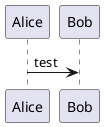

<!-- 
title:this is title
summary: this summary
tag: java,python,golang
slug: hello-boy-google 
Time: 2022-05-13
-->

# Hello World

## World 2

test  content

## test

1. first aaaaaaaaaaaaaaaaaaaaaaaaaaaaaaasssssssssssssssssssssssssssssssssssssssssssssssssssssdddddddddddddddddddddddddddddddddddddddddddddddddddddddddddddddfdddddddddddddddddddddddddddddddwwwwwwwwwwwwwwwwwwwwwwwwwww
2. second
3. third




```go
package main

import (
	"log"
	"net/http"
)

// main function
func main() {
	http.HandleFunc("/", handle)
	log.Println("Listening on addr", 8080)
	http.ListenAndServe(":8080", nil)

}

```