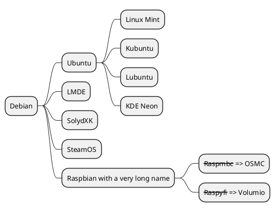
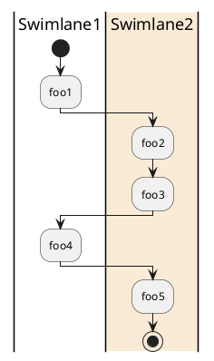

<!-- 
title:startmindmap
summary: introduce plantuml
tag: java,python,golang
slug: test-startmindmap
Time: 2022-05-13
-->

# mind map

```plantuml
@startmindmap
* Debian
** Ubuntu
*** Linux Mint
*** Kubuntu
*** Lubuntu
*** KDE Neon
** LMDE
** SolydXK
** SteamOS
** Raspbian with a very long name
*** <s>Raspmbc</s> => OSMC
*** <s>Raspyfi</s> => Volumio
@endmindmap
```

## i am split line

```plantuml
@startuml
|Swimlane1|
start
:foo1;
|#AntiqueWhite|Swimlane2|
:foo2;
:foo3;
|Swimlane1|
:foo4;
|Swimlane2|
:foo5;
stop
@enduml
```

