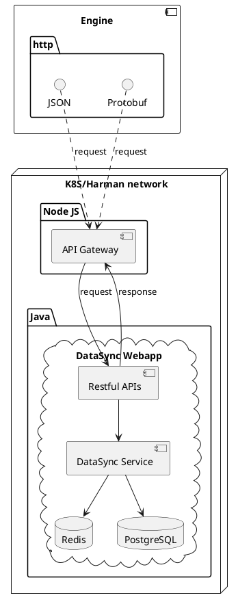

<!-- 
title:startmindmap
summary: this plantuml workflow
tag: java,python,golang
slug: plantuml-workflow
Time: 2022-05-13
-->

# Workflow example

```plantuml
@startuml
node "K8S/Harman network"{
    package "Java" {

        cloud "DataSync Webapp"{
            [Restful APIs] as RestfulAPI
            [DataSync Service]
            database "Redis"
            database "PostgreSQL"  
        }
    }

    package "Node JS" {
        [API Gateway]
    }

 }
component  "Engine"{
	package "http"{
	 () "JSON"
     () "Protobuf"    
    }
}

JSON ..> [API Gateway] : request
Protobuf ..> [API Gateway] : request
[API Gateway] --> [RestfulAPI] : request
[API Gateway] <-- [RestfulAPI] : response
[RestfulAPI] --> [DataSync Service]
[DataSync Service] --> [Redis]
[DataSync Service] --> [PostgreSQL]
@enduml

```
